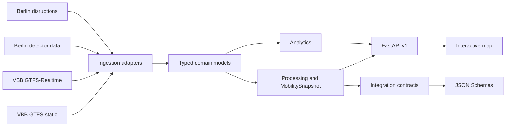

# Architecture

## Design goals

The architecture separates provider-specific retrieval from stable mobility semantics. A change in a VBB or Berlin source format should be handled in an ingestion adapter rather than forcing a rewrite of analytics or downstream integration contracts.

The project also treats degradation as normal operating state: an unavailable provider can reduce completeness without causing fabricated substitute observations.

## Modules

- `ingestion`: HTTP retrieval and provider/schema adapters for GTFS, GTFS-Realtime, traffic detectors and disruptions.
- `domain`: typed Pydantic models for mobility entities, provenance, quality, availability and integration records.
- `processing`: point-in-time state construction, timezone handling, CRS transformations, traffic temporal-quality annotation and retrieval orchestration.
- `analytics`: transparent transit, detector, baseline/anomaly, disruption and state-summary calculations.
- `storage`: typed JSON snapshot persistence.
- `api`: FastAPI application and in-memory runtime state.
- `integration`: stable downstream export transformations.
- `frontend`: geospatial visualisation consuming versioned API endpoints only.
- `tests`: deterministic unit, parser, schema, quality, temporal, geospatial, API and integration tests.

## Data flow

## Provider isolation

`MobilityHttpClient` is an infrastructure adapter. Domain models do not import `httpx`. Parsers receive bytes/dictionaries plus retrieval metadata, which makes them testable without live network access.

The runtime refresh pipeline catches provider failures independently and records them in `source_errors`. Successful sources remain usable. `RuntimeState.health_status` becomes `degraded` while missing/error information is exposed through API status and snapshots.

## Mobility state engine

`RuntimeState` contains the currently loaded schedule entities and observations. `build_snapshot()` constructs a point-in-time view by:

1. rejecting future transit/traffic observations relative to the requested timestamp;
2. selecting the latest known observation per transit trip/stop and detector;
3. selecting disruptions whose validity interval contains the timestamp;
4. carrying source freshness, errors and missing-source warnings into the snapshot.

This is deliberately not a simulator. It represents information known from the available data.

## Temporal architecture

Source-local naive Berlin timestamps are resolved explicitly with `Europe/Berlin`. Nonexistent spring-forward times are rejected. Ambiguous autumn times require an explicit fold decision when the source itself supplies no offset. Resolved timestamps are normalised to UTC for internal comparison.

## Spatial architecture

External geographic interchange uses EPSG:4326. Metric computations use EPSG:25833 through `pyproj` with explicit axis order. Spatial disruption concentration projects centroids before assigning metric grid cells.

No road-edge network model is currently authoritative inside this repository; therefore disruption ingestion does not claim an affected edge merely from street text.

## API and visualisation

FastAPI exposes `/api/v1/*` routes and OpenAPI. The built frontend can be mounted by the same application. The browser asks the API for real stops, detectors, disruptions and status; empty or degraded results are displayed as such rather than replaced with demo values.

## Integration boundary

The `integration` module converts internal snapshots/disruptions into versioned `IntegrationMobilitySnapshot` and `NetworkDisruption` models. Generated JSON Schemas provide a language-neutral contract for other Berlin digital-twin repositories.
